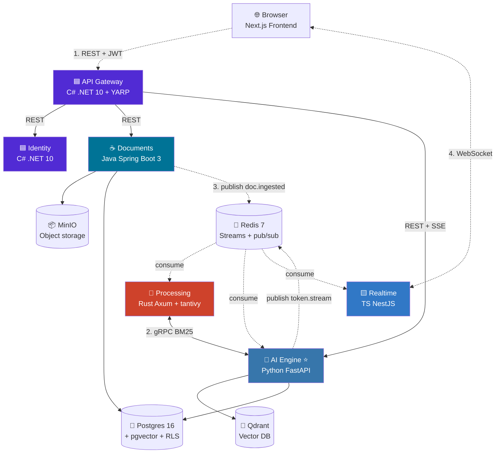

# Enterprise AI Assistant

> **Enterprise AI Assistant Platform** — kurumsal dokümanlardan (PDF / DOCX) RAG ile soru cevaplama yapan, çok kiracılı (multi-tenant) bir SaaS. Polyglot monorepo: **C# · Java · Rust · Python · TypeScript** — beş dil ekosistemini ve dört mikroservis iletişim desenini tek projede gösterir.

[](./ROADMAP.md)
[](./ROADMAP.md#phase-b--code-gen--db-foundation-)
[](LICENSE)


> **🚧 Bu repo açık geliştirme aşamasında.** Phase A (iskelet) tamamlandı; bir sonraki faz için yol haritası: [ROADMAP.md](./ROADMAP.md). Servisler şu an minimum çalışır iskelet; business logic faz-faz dolduruluyor.

## Bu nedir?

Şirketlerin kendi iç dokümanlarını (PDF, DOCX) yükleyip üzerinden Claude/GPT destekli RAG (Retrieval-Augmented Generation) ile soru sorabildiği çok kiracılı bir AI asistan platformu. Beş dil ekosistemindeki yetkinliği ve dört farklı mikroservis iletişim desenini (REST, gRPC, async pub/sub, WebSocket/SSE) tek projede demonstre etmek için **polyglot monorepo** olarak inşa edildi.

## Mimari



## Servisler

| # | Servis | Stack | Port | Sorumluluk |
|---|---|---|---|---|
| 1 | [gateway](services/gateway/) | C# .NET 10 / YARP | 8080 | Reverse proxy, JWT validation, rate limit, request aggregation |
| 2 | [identity](services/identity/) | C# .NET 10 | 8081 | OAuth2/OIDC, user/tenant CRUD, JWT issuance, RBAC |
| 3 | [documents](services/documents/) | Java Spring Boot 3 | 8082 | Upload, Apache Tika parse, MinIO storage, metadata, `doc.ingested` event |
| 4 | [processing](services/processing/) | Rust Axum + tantivy | 8083 | Semantic chunking, BM25 inverted index, gRPC server |
| 5 | [aiengine ⭐](services/aiengine/) | Python FastAPI | 8084 | Embeddings, Qdrant, hybrid retrieval, LiteLLM, agent loop, RAG eval |
| 6 | [realtime](services/realtime/) | TS NestJS | 8085 | WebSocket gateway, Redis pub/sub fanout, token streaming |
| — | [frontend](frontend/) | Next.js 15 | 3000 | Chat UI, doc upload, real-time token stream |

## İletişim desenleri

Mikroservis öğrenmenin asıl yeri "kaç servis var" değil, "nasıl konuşuyorlar". Bu projede 4 desen birlikte:

| # | Desen | Kullanım |
|---|---|---|
| 1 | **Synchronous REST** | Browser ↔ Gateway ↔ Servisler — JSON over HTTP |
| 2 | **Synchronous gRPC** | AI Engine ↔ Processing — typed protobuf contracts, binary serialization |
| 3 | **Async Pub/Sub** | Documents → Processing/AI Engine — Redis Streams ile consumer group, fire-and-forget |
| 4 | **Server Push** | Realtime → Browser — WebSocket + SSE ile LLM token stream |

## Hızlı başlangıç

```bash
# 1. Repo'yu klonla
git clone https://github.com/FurkanSay/enterprise-ai-assistant
cd enterprise-ai-assistant

# 2. Ortam değişkenlerini hazırla
cp .env.example .env
# .env dosyasını düzenle — en azından ANTHROPIC_API_KEY ekle

# 3. Tüm stack'i ayağa kaldır
make up

# 4. Sağlık kontrolü
make health

# Şimdi:
# Frontend:  http://localhost:3000
# Gateway:   http://localhost:8080
# Jaeger UI: http://localhost:16686  ← trace görselleştirme
# Grafana:   http://localhost:3001
```

## Dokümantasyon

| Doküman | İçerik |
|---|---|
| [ROADMAP.md](./ROADMAP.md) | Faz-faz yol haritası ve mevcut durum |
| [ARCHITECTURE.md](./ARCHITECTURE.md) | Derin teknik karar dokümanı |
| [docs/architecture/](./docs/architecture/) | ADR'ler (Architecture Decision Records) |
| [docs/claw-learnings/](./docs/claw-learnings/) | Claude Code internals analizinden çıkarılan referans notları |
| [docs/mvp-tools/](./docs/mvp-tools/) | Domain-spesifik tool tasarım notları (RAG, text-to-SQL, file gen) |
| [protos/](./protos/) | gRPC kontrat tanımları — kanonik kaynak |

## Üretim sınıfı ekler

- ✅ **Tek `make up`** ile her şey ayağa kalkıyor
- ✅ **OpenTelemetry + Jaeger** — bir request'in 5 servisten geçişini görselleştirme
- ✅ **Per-service `/health` endpoint'leri** — readiness/liveness ayrımı
- ✅ **Service başına ayrı CI** — GitHub Actions matrix
- ✅ **Service başına ayrı README** + kök ARCHITECTURE.md
- ✅ **Postgres RLS** — tenant izolasyonu DB seviyesinde garanti
- ✅ **Protobuf kontratları** — `buf` ile lint + breaking-change kontrol
- ✅ **Testcontainers (Java)**, **integration tests** her dilde

## Lisans

MIT
