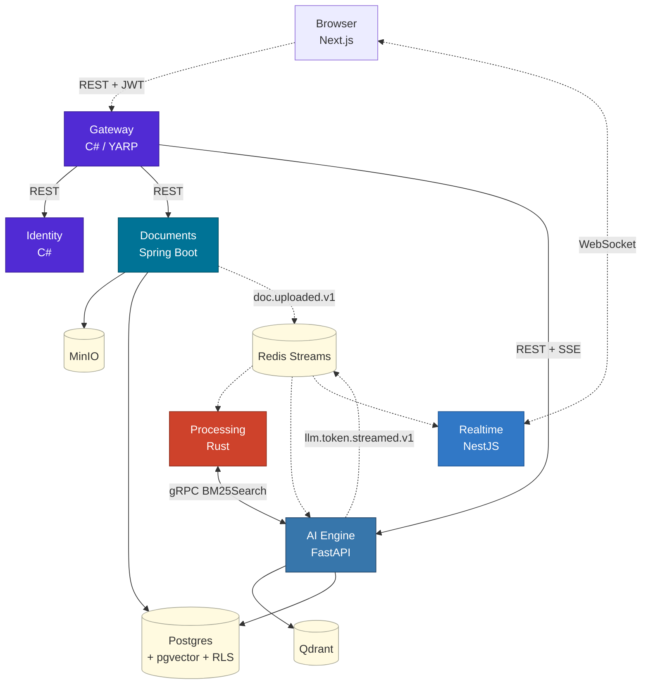

<div align="center">

# Enterprise AI Assistant

A multi-tenant retrieval-augmented AI assistant platform, built as a polyglot microservices monorepo across **C#, Java, Rust, Python, and TypeScript**.

[](./ROADMAP.md)
[](./ROADMAP.md#refresh-token-flow-)
[](./ROADMAP.md#admin-grafana-dashboard-)
[](./LICENSE)


</div>

> Phases A through M are complete: skeleton, code-gen, real RAG pipeline, JWT + refresh-token rotation, document ingestion, agent loop with tool registry, Deep Search literature mode, conversation forking, hybrid retrieval, and an admin observability dashboard. Progress is tracked in [ROADMAP.md](./ROADMAP.md); `main` is kept buildable on every commit.

---

## Overview

The platform lets a tenant upload internal documents (PDF, DOCX) and query them through a retrieval-augmented generation pipeline backed by an LLM provider. Tenant data is isolated at every layer: JWT claims, request-scoped context, Postgres row-level security, vector store filters, object storage scoping, and audit logging.

Each microservice is written in the language best suited to its domain:

- **Rust** — chunking and BM25 indexing (CPU-bound, memory-safe handling of untrusted documents)
- **Python** — AI engine (mature ML ecosystem: transformers, sentence-transformers, LiteLLM, Qdrant client)
- **Java** — document ingestion (transactional file operations, Apache Tika, JPA)
- **C#** — API gateway and identity (YARP reverse proxy, Clean Architecture)
- **TypeScript / Node** — WebSocket fanout (event-loop concurrency for high-throughput streaming)

## Design decisions

- Five language runtimes in a single monorepo; each service uses the toolchain native to its concern.
- Four communication patterns are exercised end-to-end: synchronous REST, synchronous gRPC, asynchronous pub/sub over Redis Streams, and server push via WebSocket and SSE.
- Tenant isolation uses defense in depth: JWT → request context → Postgres `FORCE ROW LEVEL SECURITY` → Qdrant payload filter → MinIO path scoping → append-only audit log.
- Observability is OpenTelemetry-first; traces, metrics, and logs flow through an OTel collector to Jaeger and Prometheus.
- API contracts live under `protos/` as the source of truth; stubs for all five languages are code-generated via `buf` with lint and breaking-change checks in CI.
- The RAG pipeline combines dense retrieval (Qdrant) with sparse retrieval (tantivy BM25), fused via Reciprocal Rank Fusion and refined by a cross-encoder reranker.
- The agent loop uses a three-source tool registry (built-in, plugin, runtime) with per-tenant permission policies and pre/post hooks for audit and redaction. Reference notes distilled from a deep read of Claude Code's internals are kept under [docs/claw-learnings/](./docs/claw-learnings/).

## Architecture



End-to-end ingestion and query sequence: [docs/architecture/diagrams/upload-flow.mmd](./docs/architecture/diagrams/upload-flow.mmd).

## Services

| Service | Stack | Port | Responsibility |
|---|---|---|---|
| [gateway](./services/gateway/) | C# .NET 10 / YARP | 8080 | Reverse proxy, JWT validation, Redis rate-limit, tenant header forwarding |
| [identity](./services/identity/) | C# .NET 10 (Clean Architecture) | 8081 | OAuth2 / OIDC, user and tenant CRUD, JWT issuance, JWKS, RBAC |
| [documents](./services/documents/) | Java 21 / Spring Boot 3 | 8082 | Upload, Apache Tika parse, MinIO storage, JPA, event publish |
| [processing](./services/processing/) | Rust / Axum + tantivy | 8083 | Semantic chunking (rayon), BM25 inverted index, gRPC server |
| [aiengine](./services/aiengine/) | Python 3.12 / FastAPI | 8084 | Agent loop, tool registry, RAG pipeline, LiteLLM, SSE streaming |
| [realtime](./services/realtime/) | TypeScript / NestJS + Fastify | 8085 | WebSocket gateway, Redis pub/sub fanout, token streaming |
| [frontend](./frontend/) | Next.js 15 / React 19 | 3000 | Chat UI, document upload, real-time token render |

## Communication patterns

| # | Pattern | Where it is used |
|---|---|---|
| 1 | Synchronous REST | Browser ↔ Gateway ↔ services — JSON over HTTP |
| 2 | Synchronous gRPC | AI Engine ↔ Processing — typed Protobuf contracts, binary serialization |
| 3 | Asynchronous pub/sub (Redis Streams) | Documents → Processing / AI Engine — consumer groups, replay |
| 4 | Server push (WebSocket + SSE) | Realtime → Browser — LLM token streaming, document status notifications |

## Quick start

```bash
git clone https://github.com/FurkanSay/enterprise-ai-assistant
cd enterprise-ai-assistant

cp .env.example .env
# At minimum, set one of OPENROUTER_API_KEY or ANTHROPIC_API_KEY.
# DEFAULT_LLM_MODEL defaults to a free OpenRouter model; override to
# something with a paid tier if you hit rate limits.

docker compose up -d --build      # ~20 min cold, seconds warm
docker compose ps                 # wait until every service is healthy
```

Endpoints:

| What | Where |
|---|---|
| Frontend | http://localhost:3000 |
| Gateway (API) | http://localhost:8080 |
| Jaeger (distributed traces) | http://localhost:16686 |
| Grafana | http://localhost:3001 (admin/admin) — token-usage dashboard at `/d/kai-token-usage` |
| MinIO console | http://localhost:9001 |

### Demo flow

1. Open http://localhost:3000 → **Kayıt ol**, pick any email + password.
2. Log in. You're redirected to **/chat**. The session keeps refreshing
   its access token in the background — leave the tab open for hours,
   it stays signed in.
3. Click **Dokümanlar** in the header → upload a `.txt` / `.pdf` / `.docx`.
4. Watch the status badge progress UPLOADED → PARSING → CHUNKING →
   EMBEDDING → READY (~2-5 seconds on a small file). Deleting the
   row also purges the matching Qdrant points and tantivy entries.
5. Back to **Sohbet**. Ask the assistant something about the document —
   tokens stream in. Reasoning models drop a separate "thinking" panel
   while they cogitate; large pasted text shows as a clickable card.
6. Toggle **Deep Search** in the chat input → ask "find 10 papers on
   vector database benchmarks after 2023." The aggregator hits
   OpenAlex / Semantic Scholar / arXiv in parallel, dedupes by DOI,
   auto-ingests every hit into your RAG collection, and tags each
   document with `source_session_id` so the Documents page can filter
   "only papers from this chat".
7. (Operator) Open http://localhost:3001 (admin / admin) → **KAI →
   Token usage & platform stats**. Shows per-user token spend, model
   distribution, daily input/output bars, and total documents — all
   driven by `messages.token_usage` JSONB and `platform_admin` (BYPASSRLS).

### End-to-end smoke (one-shot)

```bash
./scripts/e2e-smoke.sh
```

Walks the full happy path with curl, asserts on every step, exits non-zero
on the first failure. Useful for CI and for catching the kind of cross-
service breakage that only shows up when everything is up at once.

## Project structure

```
enterprise-ai-assistant/
├── README.md · ARCHITECTURE.md · ROADMAP.md · LICENSE
├── docker-compose.yml · docker-compose.override.yml · Makefile
├── protos/                    gRPC contracts (buf workspace, source of truth)
├── services/
│   ├── gateway/               C# .NET 10 / YARP
│   ├── identity/              C# .NET 10 (Domain · Application · Infrastructure · Api)
│   ├── documents/             Java Spring Boot 3
│   ├── processing/            Rust Cargo workspace (3 crates)
│   ├── aiengine/              Python FastAPI (agent · tools · rag · providers · api · core)
│   └── realtime/              TypeScript NestJS + Fastify
├── frontend/                  Next.js 15 + React 19 + Tailwind
├── libs/                      shared utilities and generated gRPC stubs
├── infra/                     Postgres init (RLS, roles, schemas), OTel, Prometheus, Grafana
├── docs/
│   ├── architecture/          ADRs and Mermaid diagrams
│   ├── claw-learnings/        reference notes from Claude Code internals analysis
│   └── mvp-tools/             tool design notes
└── .github/workflows/         per-service CI and proto-validate
```

## Status

| Phase | Description | Status |
|---|---|---|
| A | Monorepo skeleton, services, infrastructure, gRPC contracts | Done |
| B | `buf generate`, DB migrations, RLS policies live | Done |
| C | AI Engine LLM streaming → DB persist → SSE | Done |
| D | Documents upload, Tika parse, MinIO, event publish | Done |
| E | Processing chunker, tantivy, fastembed, Qdrant, Redis consumer | Done |
| F | Identity login, register, JWT, /me; Gateway HS256 validation | Done |
| G | Realtime WebSocket auth, Redis pub/sub fanout from AI Engine | Done |
| H | Frontend chat UI (Next.js, JWT auth, SSE streaming, doc upload) | Done |
| I | End-to-end smoke script + observability polish | Done |
| J | Grounded RAG with citations + sessions + conversation forking + paste-attachment chips | Done |
| K | Chunker UTF-8 panic guard + reasoning-model thinking panel + typewriter dripping | Done |
| L | Deep Search literature mode: OpenAlex / Semantic Scholar / arXiv aggregator + auto-ingest + source-tagging | Done |
| M | Cards-on-reload, Documents `?source_session_id=` filter, `doc.deleted.v1` consumer (Qdrant + tantivy cleanup) | Done |
| — | Refresh-token rotation (single-use) + `/logout` revoke + frontend single-flight retry | Done |
| — | Admin Grafana dashboard: cross-tenant token usage + per-model + per-user | Done |

Detailed plan and working agreements: [ROADMAP.md](./ROADMAP.md).

## Documentation

| Document | Contents |
|---|---|
| [ARCHITECTURE.md](./ARCHITECTURE.md) | Technical decisions: service responsibilities, communication patterns, multi-tenant strategy, observability, security model |
| [docs/architecture/](./docs/architecture/) | Architecture Decision Records |
| · [ADR-001 Monorepo polyglot](./docs/architecture/001-monorepo-polyglot.md) | Language selection, monorepo trade-offs |
| · [ADR-002 Shared DB + RLS](./docs/architecture/002-shared-db-rls.md) | Multi-tenant isolation strategy |
| · [ADR-003 gRPC contracts](./docs/architecture/003-grpc-contracts.md) | Proto-first workflow with `buf` |
| · [ADR-004 Event naming and versioning](./docs/architecture/004-event-naming-versioning.md) | Redis Streams event taxonomy and envelope |
| [docs/architecture/diagrams/](./docs/architecture/diagrams/) | Mermaid diagrams (high-level, upload-flow sequence) |
| [docs/claw-learnings/](./docs/claw-learnings/) | Reference notes from Claude Code internals analysis |
| [protos/](./protos/) | gRPC schemas (lint with `make proto-lint`) |

Each service also has its own README inside its folder.

## Operational details

- `make up` brings the full stack online (services and infrastructure containers).
- OpenTelemetry tracing is wired across all five services and visualized in Jaeger.
- Each service exposes `/health/live` and `/health/ready` endpoints.
- Each service has its own GitHub Actions workflow; a separate `proto-validate` workflow runs `buf lint` and breaking-change checks.
- Postgres uses `FORCE ROW LEVEL SECURITY` — the table owner cannot bypass tenant isolation.
- Dockerfiles are multi-stage with healthchecks and non-root users.
- `.env.example` is checked in; no secrets are committed.

## License

[MIT](./LICENSE)
